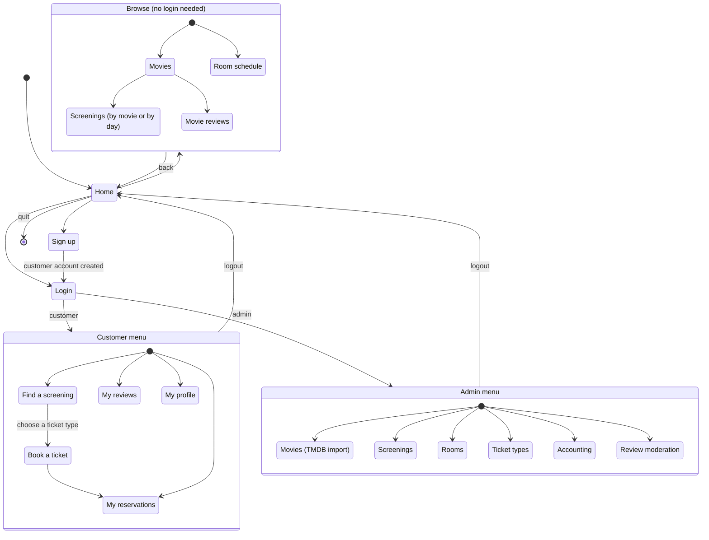

# Diagramme d'activité

```mermaid
stateDiagram-v2
    state "Browse (no login needed)" as Browse
    state "Sign up" as SignUp
    state "Customer menu" as CustomerMenu
    state "Admin menu" as AdminMenu

    [*] --> Home
    Home --> Browse
    Home --> SignUp
    Home --> Login
    Home --> [*] : quit

    SignUp --> Login : customer account created
    Login --> CustomerMenu : customer
    Login --> AdminMenu : admin

    state Browse {
        state "Movies" as browse_movies
        state "Screenings (by movie or by day)" as browse_screenings
        state "Room schedule" as browse_rooms
        state "Movie reviews" as browse_reviews

        [*] --> browse_movies
        [*] --> browse_rooms
        browse_movies --> browse_screenings
        browse_movies --> browse_reviews
    }
    Browse --> Home : back

    state CustomerMenu {
        state "Find a screening" as c_find
        state "Book a ticket" as c_book
        state "My reservations" as c_reservations
        state "My reviews" as c_reviews
        state "My profile" as c_profile

        [*] --> c_find
        c_find --> c_book : choose a ticket type
        c_book --> c_reservations
        [*] --> c_reservations
        [*] --> c_reviews
        [*] --> c_profile
    }
    CustomerMenu --> Home : logout

    state AdminMenu {
        state "Movies (TMDB import)" as a_movies
        state "Screenings" as a_screenings
        state "Rooms" as a_rooms
        state "Ticket types" as a_tickets
        state "Accounting" as a_accounting
        state "Review moderation" as a_moderation

        [*] --> a_movies
        [*] --> a_screenings
        [*] --> a_rooms
        [*] --> a_tickets
        [*] --> a_accounting
        [*] --> a_moderation
    }
    AdminMenu --> Home : logout
```