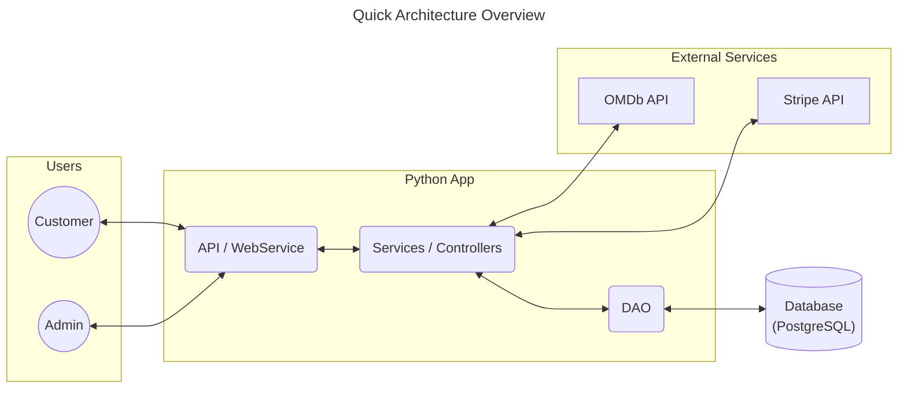

# Architecture 

```mermaid
---
title: Quick Architecture Overview
---
graph LR
    subgraph Users ["Users"]
        CUST((Customer))
        ADMIN((Admin))
    end

    subgraph App ["Python App"]
        API("API / WebService")
        SVC("Services / Controllers")
        DAO("DAO")
        API <--> SVC <--> DAO
    end

    DB[("Database<br/>(PostgreSQL)")]

    subgraph External ["External Services"]
        MDBAPI["OMDb API"] ~~~ STPAPI["Stripe API"]
    end

    CUST <--> API
    ADMIN <--> API
    DAO <--> DB
    SVC <--> STPAPI
    SVC <--> MDBAPI
```