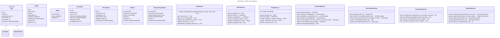

```mermaid
---
title: Movie App - Python Class Diagram
---
classDiagram
    %% ========================
    %% == MODELS ==============
    %% ========================

    class User {
        <<abstract>>
        +id: int
        +email: str
        +password_hash: str
        +first_name: str
        +last_name: str
        +created_at: datetime.datetime
    }

    class Customer {
    }

    class Administrator {
    }
    
    User <|-- Customer
    User <|-- Administrator

    class Movie {
        +id: int
        +imdb_id: str
        +title: str
        +description: str
        +duration_minutes: int
        +release_date: datetime.date
        +rating: float
        +poster_url: str
    }

    class Room {
        +id: uuid.UUID
        +room_number: int
        +capacity: int
    }

    class Screening {
        +id: int
        +movie_id: int
        +room_id: int
        +start_time: datetime.datetime
        +end_time: datetime.datetime
        +ticket_price: float
        +available_places: int
    }

    class Reservation {
        +id: int
        +customer_id: int
        +screening_id: int
        +total_amount: float
        +payment_status: str
        +reserved_at: datetime.datetime
    }

    class Review {
        +id: uuid.UUID
        +customer_id: uuid.UUID
        +movie_id: uuid.UUID
        +rating: int
        +comment: str
        +created_at: datetime.datetime
    }

    class PaymentTransaction {
        +id: uuid.UUID
        +reservation_id: uuid.UUID
        +stripe_payment_intent_id: str
        +amount: decimal.Decimal
        +status: str
        +created_at: datetime.datetime
    }

    %% ========================
    %% == SERVICES ============
    %% ========================

    class UserService {
        +create_user(username, password, email, first_name, last_name): User
        +get_user(user_id): User
        +get_user_by_email(email): User
        +update_user_profile(user_id, data): User
        +delete_user(user_id): bool
        +authenticate_user(email, password): User
    }

    class MovieService {
        +get_by_id(movie_id): Movie
        +get_all_movies(): List~Movie~
        +search_movies(query): List~Movie~
        +create_movie(movie_data): Movie
        +update_movie(movie_id, data): Movie
        +delete_movie(movie_id): bool
    }

    class RoomService {
        -room_repo: RoomRepo
        +get_by_id(room_id): Room
        +get_all_rooms(): List~Room~
        +create_room(room_number, capacity): Room
        +update_room(room_id, data): Room
        +delete_room(room_id): bool
    }

    class ScreeningService {
        +get_by_id(screening_id): Screening
        +get_screenings_by_date(date): List~Screening~
        +get_screenings_by_movie(movie_id): List~Screening~
        +get_available_screenings(date): List~Screening~
        +create_screening(movie_id, room_id, start_time, ticket_price): Screening
        +update_screening(screening_id, data): Screening
        +delete_screening(screening_id): bool
    }

    class ReservationService {
        +get_by_id(reservation_id): Reservation
        +get_customer_reservations(customer_id): List~Reservation~
        +create_reservation(customer_id, screening_id, seats): Reservation
        +cancel_reservation(reservation_id): bool
        +confirm_reservation(reservation_id): Reservation
    }

    class AccountingService {
        +get_accounting_by_movie(movie_id, start_date, end_date): dict
        +get_accounting_by_period(start_date, end_date): dict
        +get_revenue_summary(start_date, end_date): dict
        +get_occupancy_rate(start_date, end_date): float
    }

    class PaymentService {
        +create_payment_intent(reservation_id, amount): PaymentTransaction
        +process_payment(reservation_id, stripe_token): PaymentTransaction
        +confirm_payment(transaction_id): PaymentTransaction
        +refund_payment(transaction_id): PaymentTransaction
        +get_transaction_status(transaction_id): str
    }

```

