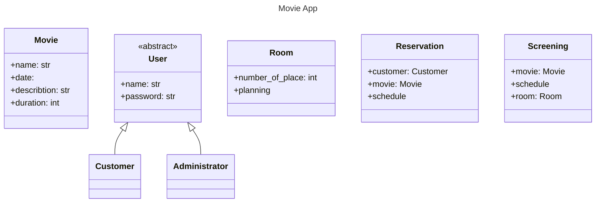

```mermaid
---
title: Movie App
---
classDiagram
    class Movie{
        +name: str
        +date: 
        +describtion: str
        +duration: int
    }
    
    class User{
        <<abstract>>
        +name: str
        +password: str
    }

    class Customer {
    }

    class Administrator {
    }

    User <|-- Customer
    User <|-- Administrator

    class Room{
        +number_of_place: int
        +planning
    }

    class Reservation{
        +customer: Customer
        +movie: Movie
        +schedule
    }

    class Screening{
        +movie: Movie
        +schedule
        +room: Room
    }


```