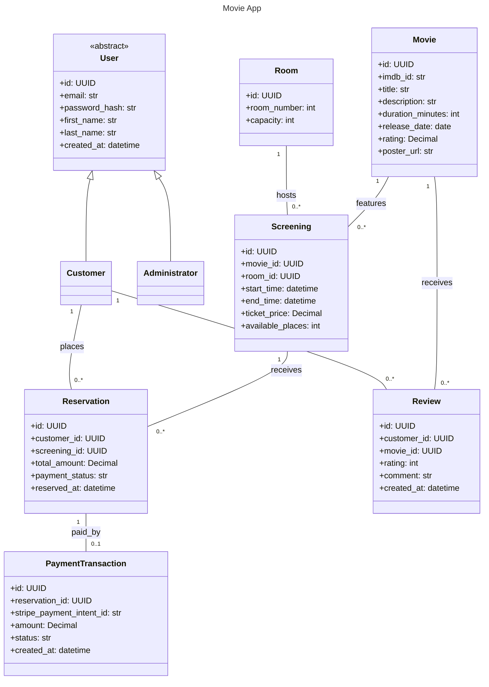

```mermaid
---
title: Movie App
---
classDiagram
    class User {
        <<abstract>>
        +id: UUID
        +email: str
        +password_hash: str
        +first_name: str
        +last_name: str
        +created_at: datetime
    }

    class Customer {
    }

    class Administrator {
    }

    User <|-- Customer
    User <|-- Administrator

    class Movie {
        +id: UUID
        +imdb_id: str
        +title: str
        +description: str
        +duration_minutes: int
        +release_date: date
        +rating: Decimal
        +poster_url: str
    }

    class Room {
        +id: UUID
        +room_number: int
        +capacity: int
    }

    class Screening {
        +id: UUID
        +movie_id: UUID
        +room_id: UUID
        +start_time: datetime
        +end_time: datetime
        +ticket_price: Decimal
        +available_places: int
    }

    class Reservation {
        +id: UUID
        +customer_id: UUID
        +screening_id: UUID
        +total_amount: Decimal
        +payment_status: str
        +reserved_at: datetime
    }

    class Review {
        +id: UUID
        +customer_id: UUID
        +movie_id: UUID
        +rating: int
        +comment: str
        +created_at: datetime
    }

    class PaymentTransaction {
        +id: UUID
        +reservation_id: UUID
        +stripe_payment_intent_id: str
        +amount: Decimal
        +status: str
        +created_at: datetime
    }

    %% Relations
    Room "1" -- "0..*" Screening : hosts
    Movie "1" -- "0..*" Screening : features
    Customer "1" -- "0..*" Reservation : places
    Screening "1" -- "0..*" Reservation : receives
    Reservation "1" -- "0..1" PaymentTransaction : paid_by
    Customer "1" -- "0..*" Review : writes
    Movie "1" -- "0..*" Review : receives
```